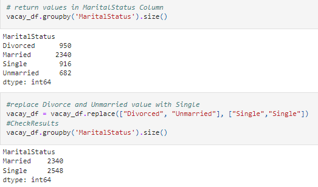

# Team_Red
Module 20 Challenge

### Roles

---
#### Communication Plan			
			

 - Project Plan for the week:	
  	* Every Tuesday 6:30 pm - 7:00 pm via Zoom call
 - Project update 	
 	* Every Thursday 6:30 pm- 7:00 pm via Zoom call
 - Review and work together 	
 	* Every Friday 6:00 pm-6:30 pm via Zoom Call
 - Review and finalize together before submission 	
 	* Every Saturday 11:00 pm - 12:00 pm via Zoom Call

---
#### Technologies used for this Project:

- Python
- Pandas
- Sklearn
- Tableau
- PostgreSQL

---
### Topic of our Project

We will analyze a Holiday package Dataset. The purpose of this analysis is to look at past events and use Data analysis and Machine learning to give business recommendations to our client on which demographic would most likely purchase a newly introduced vacation package.

---
#### Reason for Selection: 

-	One of our team members is familiar with the industry and has a passion for analyzing this specific topic.
-	The Dataset is relevant to our questions, has enough data points and features and could be easily adapted to an industry dataset.
-	The Data seems, at first glance, to be quite clean.
-	It is publicly available and updated monthly. 

---
#### Questions we Hope to Answer:

Our client is introducing a new vacation package. They would like to answer at least one of these questions:

-	Can we predict what the ideal target customer would look like?
-	What would be a good marketing strategy?
-	What variables have the most influence on the purchase decision?

---
#### Process of Data Analysis and Evaluation

---
#### Dataset

Travel.csv from the Kaggle website
https://www.kaggle.com/susant4learning/holiday-package-purchase-prediction

Click here to get directly to the CSV file:  https://github.com/Cthompsonlbi/Team_Red/blob/main/Resources/Travel.csv

The dataset contains 20 columns and 4888 rows.
It includes Customer and Marketing information and a column that shows if the vacation package was purchased or not.
There are currently 5 types of packages the company is offering - Basic, Standard, Deluxe, Super Deluxe, King.

---
#### Mockup Machine learning Model

##### Machine Learning Model:

We decided to use a Supervised Learning Model, because our data has labeled input and output data.
It has a target column and features.
As a model we use a DecisionTree classifier and investigate further for class imbalances.
As a second validation we will be using a RandomForest classifier model.

A mockup of our Machine learning model can be found here: 

[Initial Machine Learning Mockup](Notebooks/Mock_up_Machine_Learning_Modelwith_SQL_connect.ipynb)

The Machine learning model will pull data from the PG Admin database using Heroku.
This will be set up later. Currently we have it connected through sqlalchemy to the local machine.

---
#### Mockup Database

We use PG Admin as our Database.
We have seperated the Dataset into two tables a Customer table and a Marketing table.
The 2 tables are connected through the Customer ID.

Here is a preliminary ERD:

As you can see, we have setup the tables based on the different information pertaining to both the consumer and the marketing information.
We have made the Primary Key CustomerID as this is the identifier for each piece of information per each consumer and their relative marketing info.

---
#### Rudimentary EDA 

Quick link to our EDA Jupyter notebook file that contains code for our **INITIAL** work with regards to cleaning the Travel dataset can be found below:

[Travel Dataset Initial Clean](Notebooks/InsightEDA.ipynb)

The initial steps taken after pulling the Travel.csv file into a dataframe to get a better understanding of the data that we are working with were as follows:	

	* running a count function-- count() on the dataset to capture sum of rows with values
	* running a unique function -- nunique() on the dataset to see if there were values that exceeded the anticipated amount
	* running a null function -- isnull() to identify columns that contain null values and the quantity of null values
	* merge the three resulting dataframes from the functions above into a dataframe to allow ease of analysis
	* inspecting each column using the groupby and size function --groupby().size() to identify columns with erroneous values or complex groupings
	* adjusting column values to modify erroneous values and simplify complex groupings
	
* Screenshot illustrating the combining of three dataframes created using functions count, nunique, isnull

* Screenshot illustrating the use of the groupby function and replace function to modify column values

	
* Additional screenshot of groupby function and replace function to modify column values

