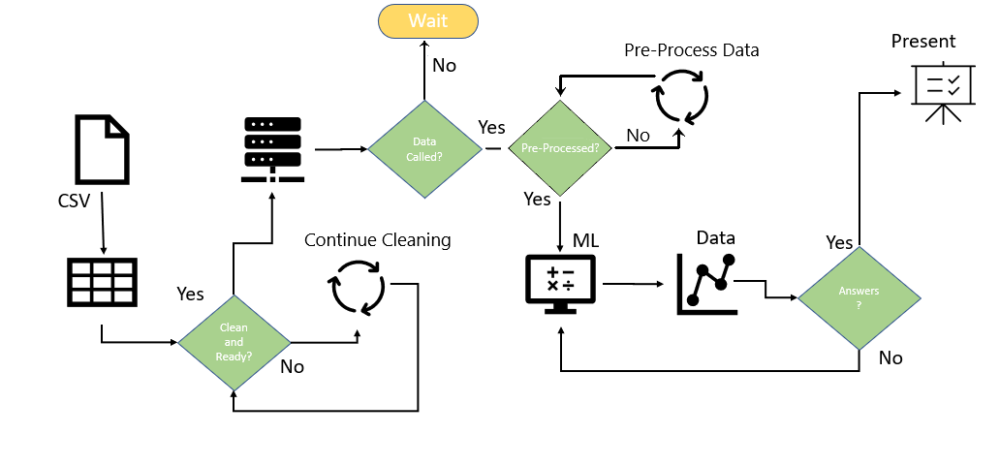
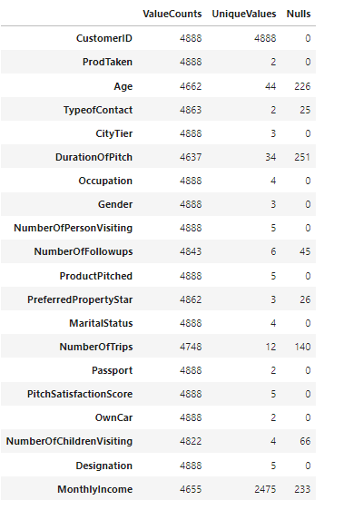
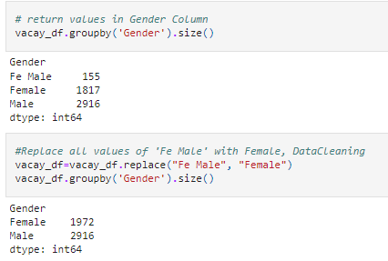

# Team_Red -- Module 20 Challenge

## Topic

We will analyze a Holiday package dataset to identify key market segments, and to manufacture a high level strategy to connect to target groups to sell them the getaway package at a higher success rate.

If you would like to access the slideshow for a more brief report, you can do so [here](https://docs.google.com/presentation/d/1I5h9CG6jF9-2hxQ4abF_KSPI4CQ6rH8Pa7tIWhde0Mo/edit?usp=sharing)

### Reason for Selection: 

-	One of our team members is familiar with the hospitality industry and has a passion for analyzing this specific topic.
-	The Dataset is relevant to our questions, has enough data points and features and could be easily adapted to an industry dataset.
-	The Data is mostly intact.
-	It is publicly available and updated monthly. 

### Questions We Hope to Answer:

Our client would like to answer at least one of these questions:

-	Can we predict what the ideal target customer would look like?
-	What would be a good marketing strategy?
-	What variables have the most influence on the purchase decision?

### Roles

---
## Dataset

Travel.csv from the Kaggle website - [here](https://www.kaggle.com/susant4learning/holiday-package-purchase-prediction)

Travel.csv from our repo - [here](https://github.com/Cthompsonlbi/Team_Red/blob/main/Resources/Travel.csv)

The dataset contains 20 columns and 4888 rows, which includes customer and marketing information, as well as a target column that shows if the vacation package was purchased or not.

There are currently 5 types of packages the company is offering:

- Basic
- Standard
- Deluxe
- Super Deluxe
- King

---
## Technologies Used:

Language:

	- Python

Programs:

	- Jupyter Notebook

	- pgAdmin 4 (PostgreSQL)

	- Tableau

Major Libraries:

	- Pandas

	- sqlalchemy

	- Scikit-learn

	- Imblearn
 
 A full list of libraries and environmental requirements can be found [here](https://github.com/Cthompsonlbi/Team_Red/requirements.txt)

---
## Process of Data Analysis and Evaluation

The data file was loaded into the EDA notebook, where it was cleaned. From there, it was uploaded to the SQL database as a new table. The new table would then be called for the machine learning portion of the analysis, and thus needed to be preprocessed (scaled, binned, encoded, resampled). Due to the imbalanced nature of the data (19% of products pitched were purchased), we trained our models with both oversampled and original training sets to compare results. In total, we were left with four models. Once preprocessed, K-Fold cross validation was performed on each model to determine the optimal parameters. Classification reports, confusion matrices, and accuracy scores were used as metrics to determine a model's performance. Finally, feature importance was pulled for later analysis. A general flow chart of the described process can be found below.

### Database

We use pgAdmin as our SQL database. The data was separated into two tables: a customer info table and a marketing info table. They share customer ID, which serves as the primary key, or unique identifier.

Here is a snapshot of the ERD:

When the clean data is sent back into the database, it is loaded into a single, new table, which is later used for machine learning and Tableau.

### Exploratory Data Analysis

Quick link to our EDA Jupyter notebook file that contains code for our work with regards to cleaning the Travel dataset can be found [here](Notebooks/InsightEDA.ipynb).

The initial steps taken after pulling the Travel.csv file into a dataframe to get a better understanding of the data that we are working with were as follows:	

	* running a count function-- count() on the dataset to capture sum of rows with values
	* running a unique function -- nunique() on the dataset to see if there were values that exceeded the anticipated amount
	* running a null function -- isnull() to identify columns that contain null values and the quantity of null values
	* merge the three resulting dataframes from the functions above into a dataframe to allow ease of analysis
	* inspecting each column using the groupby and size function --groupby().size() to identify columns with erroneous values or complex groupings
	* adjusting column values to modify erroneous values and simplify complex groupings
	* Use Sklearn SimpleImputer to Manage Null Values
	
* Screenshot illustrating the combining of three dataframes created using functions count, nunique, isnull

* Screenshot illustrating the use of the groupby function and replace function to modify column values

	
* Additional screenshot of groupby function and replace function to modify column values

### Machine Learning Model

Initially, a decision tree and logisitic regression model were used as predictive models, but were eventually replaced with more complex models such as: random forest, adaptive boost, extreme gradient boost, and neural network. Ultimately, the group decided on utilizing a random forest and an extreme gradient boost, as they not only proved to be highly effective, but were capable of providing relational insight into the data; this was especially important as the data was fairly diverse between categorical and continuous data.

Below are slides individually describing the functionality and utility of both the random forest and extreme gradient boost ('XGBoost') models:

### K-Fold Cross Validation

K-Fold cross validation is a technique used to ensure each model is tested against multiple subsets, called *folds*, of the data to average the accuracy scores. In a five-fold cross validation, the data is split into five folds, where the first four are the training sets, and the last is the validation set. The model is tested against the validation set for an accuracy score, the same way we use training and testing splits. The model then uses the 2nd to last fold of data as the validation set and repeats the process until each subset has been used as the validation once. The accuracy scores from each fold are then averaged.

Visualization of the K-Fold process:

For our models, we used both five and 10-fold cross validation to be safe - although this made the code more cumbersome to run (the ML_Master file takes over five hours to run). We passed a series of parameters through the models, adjusting one parameter at a time using for-loops. Within each model, it would use the K-Fold cross validation method, running five and 10 more times each. For example, the extreme gradient boost model iterates 2,592 times in total; one would think that it created and tested 2,592 models, but it actually tested five models per iteration for the first half, and 10 models per iteration for the last half - totalling 19,440 models.

A dictionary to store the results was created in the beginning of the code, which would contain the best set of parameters for the extreme gradient boost model. While the cross validation was run, if a new highest accuracy was discovered, all current parameters would replace the previous best parameters within this dictionary.

The block of code containing the extreme gradient boost K-Fold cross validation is provided below:

To run the final model, we called the dictionary for each of the adjusted parameters. This can be observed within the XGBClassifier, as many parameters are set equal to their respective keys in the dictionary.

### Machine Learning Model Results

After model optimization was completed, the first measurement of success was the accuracy score, which compares the predicted targets versus actual targets. The following are the accuracy scores for each model:

- Unsampled Balanced Random Forest:			87.98%
- Oversampled Balanced Random Forest:		85.75%
- Unsampled XGBoost:						93.42%
- Oversampled XGBoost:                  	86.64%

The classification reports, as well as the confusion matrices, combined into two images are presented below:

The two models with the best performance tailored to our team's objective are provided in the next image. These models were chosen not entirely based off of their accuracy scores, but by their precision and f1 scores. What is most important to our client is acquiring new customers. If we can minimize time lost from seeking people out who will not buy our product, our client can take advantage of higher conversion rates. A false negative, also known as a type 2 error, will cause our client to miss out on a potential customer. A false positive, also known as a type 1 error, will cause our staff to waste time speaking with customers who will likely deny the product, resulting in wasted time without a sale. Ideally, the models minimize both, but that was not the case. 

Below, are the two best performing models when considering our client's objective.

In addition, a chart containing the most important features, according to our oversampled random forest classifier, is provided below:

The top three features, age, monthly income, and duration of pitch, were the most weighted variables in the mix when determining if somebody purchased a getaway package. This is reflected in the charting analysis using Tableau, to be discussed later. The more accurate the machine learning model, the stronger the support provided by feature importance.

The final notebooks that display outputs can be found here:

  - [Insight EDA File](Notebooks/InsightEDA.ipynb)
  - [Insight Unsupervised File](Notebooks/InsightUnsupervised.ipynb)
  - [Machine Learning Master File](Notebooks/ML_Master.ipynb)

---
---

### WebApp Deployment  

https://cthompsonlbi.github.io/TeamRedInsight/

A Web application was developed to allow the user to interact with the data by embedding the Tableau visualization file inside the deployed .html file.  The app allows the user to click through slides and click on data with in the slide to modify data focus.  Also there is a drop down menu available that will the viewer to select a team member and return additional information about the selected team member.

---
---
## Tableau Analysis

[Link to Dashboard](https://public.tableau.com/app/profile/trevor.sreekrisenjee/viz/Insightsonthebeach4_510pm/Story1?publish=yes)

In this dashboard we were able to modify the data a bit more to allow the vizualizations to be more user friendly. 

* By creating aliases, the ProdTaken column was able to Transform from 0's and 1's to 'No' and 'Yes'. 
* Through the Grouping function we were able to simplify the MonthlyIncome and Age fields by adding them to buckets based on their respective increments.
* Our plan for this dashboard is to create specialized and informative graphs that can tell a story and lead us to the final answer of "Who will buy our vacation packages?". 

 * By creating multiple Stories we can flip through the different visualizations that progress through a story to get us to our answers!

---
---
## Google Slides

https://docs.google.com/presentation/d/1I5h9CG6jF9-2hxQ4abF_KSPI4CQ6rH8Pa7tIWhde0Mo/edit?usp=sharing

---
---
## Summary

models suggests..

Our Analysis suggests younger consumers are more likely to purchase a vacation package than their older counter parts.  18-24 year olds have a conversion rate of 45%.  Meaning that 45% of the 18-24 years that are pitched a vacation package by a sales person are likely to purchase. However, this age group is severely underserved as it represents only 5.6% of all products pitched.  25- 31 year olds have a conversion rate of 24.78% and make up about 21.4% of the dataset of products pitched.  The remaining age groups only had a conversion rate of mid to low teens. Another take away from the tableau analysis is the monthly income of potential customers that had the highest conversion rate was from $16k-$23k.  The percentage of conversion for this monthly income range was in the mid 20's.  While the remaining monthly income ranges were significantly lower.  Also, the data suggests that the most likely purchased vacation packages would be the Basic, Standard, and Deluxe packages which are the low to mid cost vacation packages and not the higher cost packages like the Super Deluxe and King packages.

With this in mind, the tableau analysis would suggest that the client should develop a marketing strategy that focuses on economical vacation packages for 18 to 31 year olds that have a monthly income in the range of $16k-$23K.

### Recommendation for Future Analysis

Where can we go from here? 

The interactive features in Tableau could be used to answer additional business questions and run through different scenarios, e.g.

- What would be the best product to pitch if we received access to a mailing list of potential customer in a certain age group/ income group?
- How should goals for employees working in sales be set based on the demographics of their region?

Based on the analysis we have completed thus far, our team of experts believes that adding more features to the dataset would exponentially increase the accuracy of our predictions. For example, if the dataset were to include the ADR (average daily rate), this would give us a better idea on what amount of money our guests are willing to pay for each package. Similarly, adding significant dates such as the date a package was booked and the dates stayed would add another level to our dataset because we would be able to analyze peak times throughout the year as well as how much of a discount customers receive for staying 4 nights versus 3 nights. The final point we would like to add is the location of the stay. We may be able to find that consumers are more likely to book a stay in Mexico during the summer time than they are during Christmas time. This will greatly increase the efficiency of our employees and the amount of time it takes for them to get a Yes from our potential guests. 

